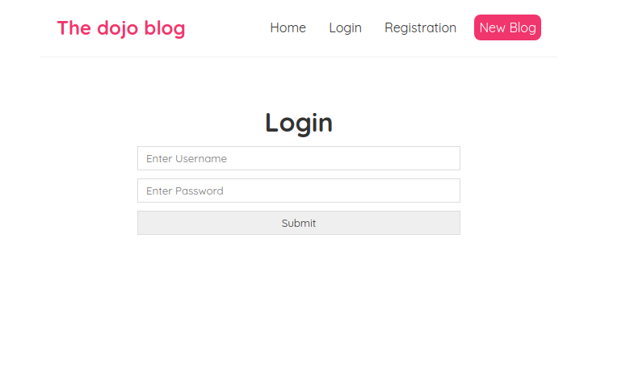
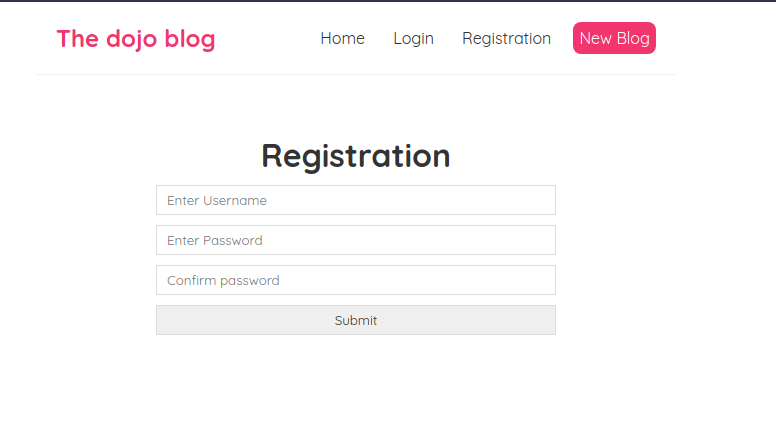
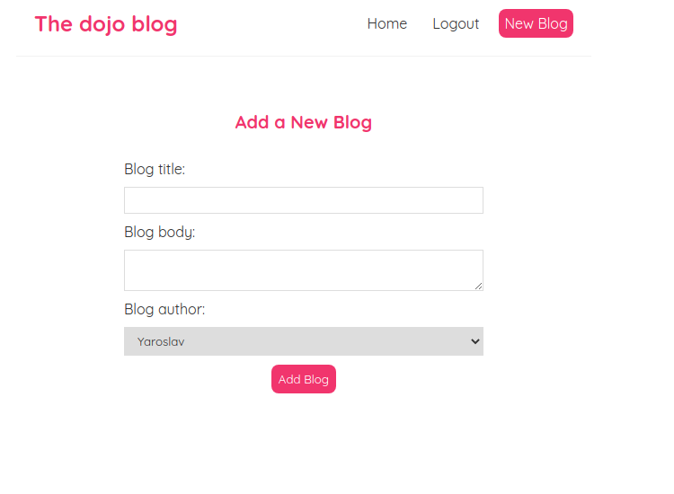
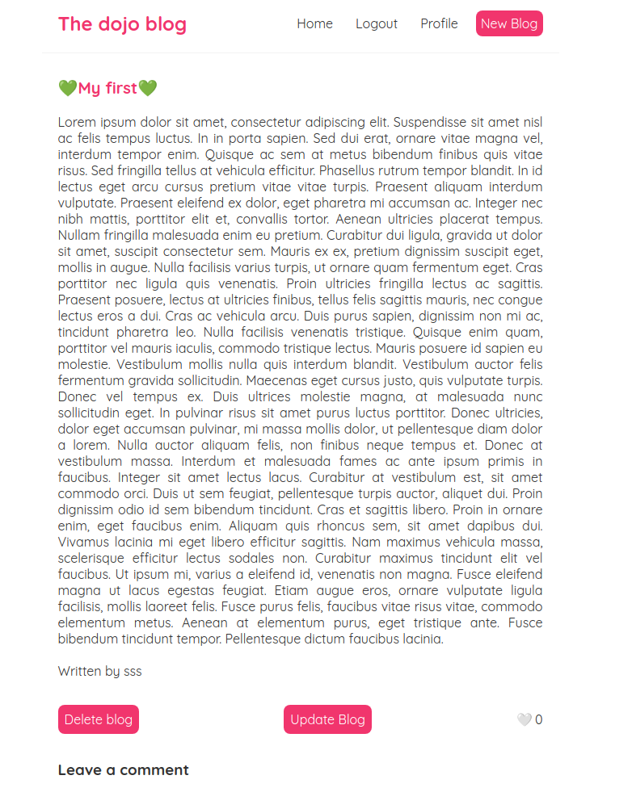
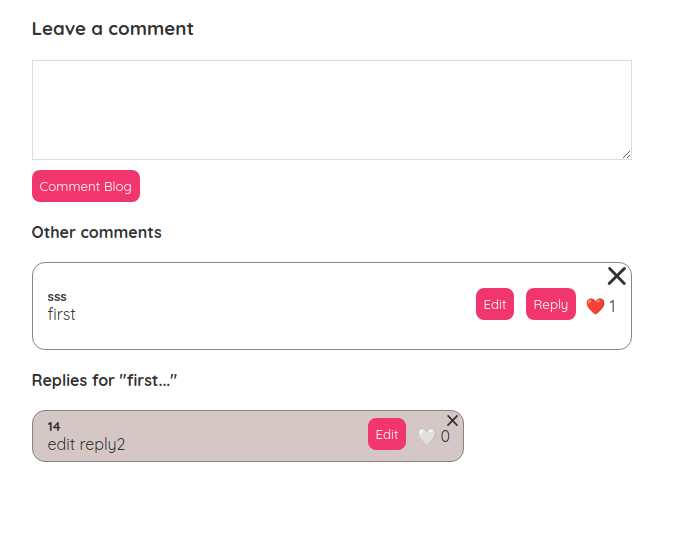
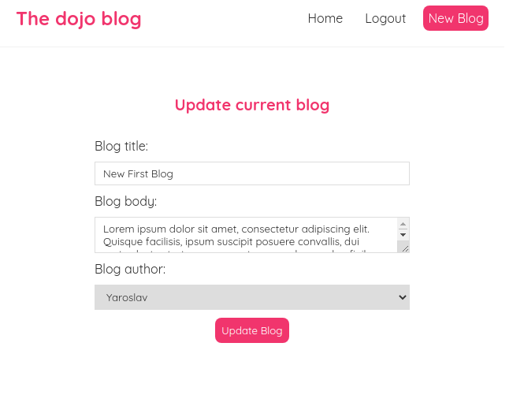

# DjangoStore

Full Rest API blog site created by using Django as backEnd language, and React JS for frontEnd part.
When we open site we need to login or sign up first, without doing this we can't see blogs

Then we can see the list of all avaluable posts, also we can add our own post

After this our post automatically will appear in our blog list
In order to see all information about post we can visit detail page

also we can like a post or leave a comment

as well was produced to edit comment or reply to it
in order to change some information we can update our post

